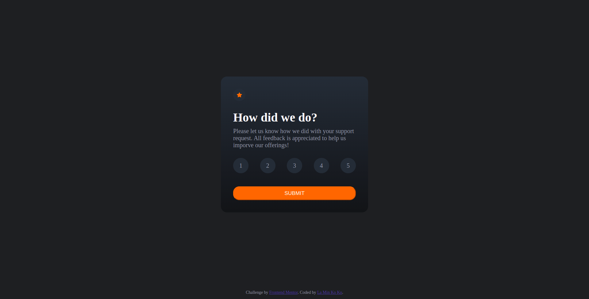

# Frontend Mentor - Interactive rating component solution

This is a solution to the [Interactive rating component challenge on Frontend Mentor](https://www.frontendmentor.io/challenges/interactive-rating-component-koxpeBUmI). Frontend Mentor challenges help you improve your coding skills by building realistic projects. 

## Table of contents

- [Overview](#overview)
  - [The challenge](#the-challenge)
  - [Screenshot](#screenshot)
  - [Links](#links)
- [My process](#my-process)
  - [Built with](#built-with)
  - [What I learned](#what-i-learned)
- [Author](#author)

## Overview

### The challenge

Users should be able to:

- View the optimal layout for the app depending on their device's screen size
- See hover states for all interactive elements on the page
- Select and submit a number rating
- See the "Thank you" card state after submitting a rating

### Screenshot

### Links

- Solution URL: [Add solution URL here](https://github.com/laminkoko243/interactive-rating-component-frontend-mentor/)
- Live Site URL: [Add live site URL here](https://laminkoko243.github.io/interactive-rating-component-frontend-mentor/)

## My process

### Built with

- Semantic HTML5 markup
- CSS custom properties
- Flexbox
- Javascript
- jQuery

## Author

- Website - [La Min Ko Ko](https://www.laminkoko.com)
- Frontend Mentor - [La Min Ko Ko](https://www.frontendmentor.io/profile/laminkoko243)
- Twitter - [La Min Ko Ko(https://www.twitter.com/laminkoko243)
- LinkedIn - [La Min Ko Ko] (https://www.linkedin.com/laminkoko)
- Facebook - [La Min Ko Ko] (https://www.facebook.com/laminkoko243)

